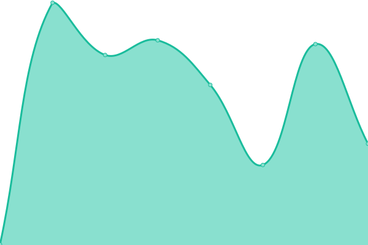

# [📈 Live Status](https://status.heliohost.org): <!--live status--> **🟧 Partial outage**

This repository contains the open-source uptime monitor and status page for [Helio Networks](https://heliohost.org), powered by [Upptime](https://github.com/upptime/upptime).

With [Upptime](https://upptime.js.org), you can get your own unlimited and free uptime monitor and status page, powered entirely by a GitHub repository. We use [Issues](https://github.com/helionetworks/status/issues) as incident reports, [Actions](https://github.com/helionetworks/status/actions) as uptime monitors, and [Pages](https://status.heliohost.org) for the status page.

<!--start: status pages-->
<!-- This summary is generated by Upptime (https://github.com/upptime/upptime) -->
<!-- Do not edit this manually, your changes will be overwritten -->
<!-- prettier-ignore -->
| URL | Status | History | Response Time | Uptime |
| --- | ------ | ------- | ------------- | ------ |
|  HelioHost | 🟩 Up | [helio-host.yml](https://github.com/HelioNetworks/status/commits/HEAD/history/helio-host.yml) | 

 672ms
     
 | 

<a href="https://status.heliohost.org/history/helio-host">100.00%</a>
    

|  Forums | 🟩 Up | [forums.yml](https://github.com/HelioNetworks/status/commits/HEAD/history/forums.yml) | 

 430ms
     
 | 

<a href="https://status.heliohost.org/history/forums">100.00%</a>
    

|  Tommy | 🟩 Up | [tommy.yml](https://github.com/HelioNetworks/status/commits/HEAD/history/tommy.yml) | 

 385ms
     
 | 

<a href="https://status.heliohost.org/history/tommy">99.61%</a>
    

|  Johnny | 🟥 Down | [johnny.yml](https://github.com/HelioNetworks/status/commits/HEAD/history/johnny.yml) | 

 285ms
     
 | 

<a href="https://status.heliohost.org/history/johnny">99.86%</a>
    

|  VPS | 🟩 Up | [vps.yml](https://github.com/HelioNetworks/status/commits/HEAD/history/vps.yml) | 

 345ms
     
 | 

<a href="https://status.heliohost.org/history/vps">100.00%</a>
    

|  Lily | 🟩 Up | [lily.yml](https://github.com/HelioNetworks/status/commits/HEAD/history/lily.yml) | 

 293ms
     
 | 

<a href="https://status.heliohost.org/history/lily">100.00%</a>
    

<!--end: status pages-->

[**Visit our status website →**](https://status.heliohost.org)

## 📄 License

- Powered by: [Upptime](https://github.com/upptime/upptime)
- Code: [MIT](./LICENSE) © [Helio Networks](https://heliohost.org)
- Data in the `./history` directory: [Open Database License](https://opendatacommons.org/licenses/odbl/1-0/)
